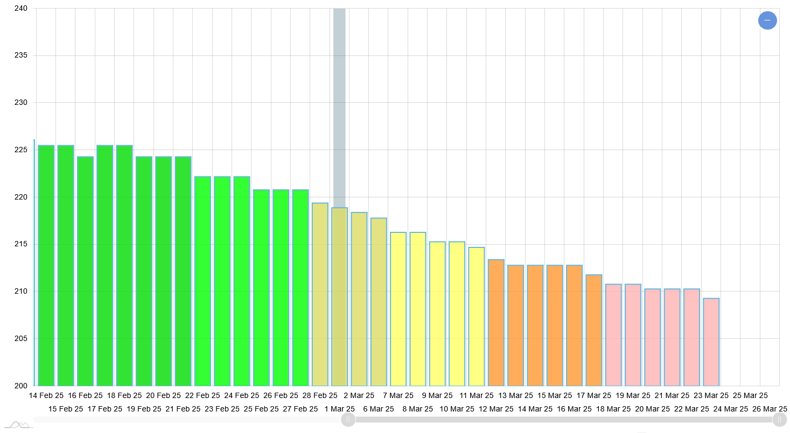

# under200

under200 is a simple weight-loss tracking application I built to track my journey!



Feel free to plug in your own data and watch the numbers fly down over the course of your journey (You may use the simple method of updating the PASTE_WEIGHT.TXT, or update/improve the backend to pull from a DB or somewhere else (objective))

- [x] Future me: update this checkbox if this repo is true. Don't let it bounce back up after accomplishing the goal!

# Install and run:

## Frontend:

The front-end for this application uses vanilla JavaScript (simple, small MVP app) with amcharts4 pulled from the official CDN.

```
# Open the endpoint created by the backend
#
# You may update `var EXERCISE_FILE` in index.html to link to this PASTE_WEIGHT.TXT
```

## Backend: 

Install

```
pip install fastapi uvicorn
```

Run

```
python main.py
```

# Objectives:
- [ ] Attach simple database to serve back-end weight data
- [ ] (re-implementation from earlier version: paste the weight data DIRECTLY into text field - populating amcharts)
- [ ] Improve amcharts custom UI - I have many more features I want to add to make the down slope prettier
- [ ] Additional tasking
